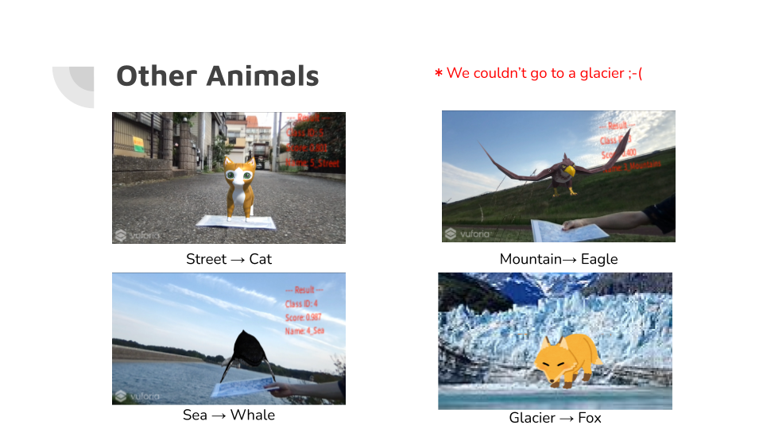

# AR ZOO
Display animals depending on the landscape.

## Usage
1. Train an image recognition model following the landscape_classify.ipynb and make onnx file to use the model on Unity．
2. Set the onnx file on Unity and use the application.

## Slides
  
  
  
  
  
  